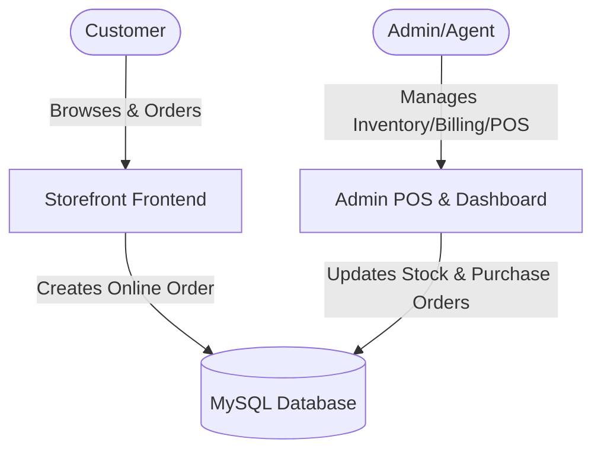

# 🛒 E-Commerce Billing & Storefront System

A comprehensive, production-grade **Laravel 12** fullstack application combining a customer-facing storefront with a robust Back-Office POS (Point of Sale), purchase stock ordering, and billing system.

---

## 🏗️ System Architecture & Codebase Overview

This application bridges the gap between public e-commerce sales and internal inventory/billing management.



### 📂 Key Directory Breakdown

*   **`app/Http/Controllers/`**: Contains core business logic.
    *   [StorefrontController.php](file:///Users/chikku/Desktop/Projects/Code/fullstack/ecom-billing/app/Http/Controllers/StorefrontController.php): Controls storefront views, product listings, categories, cart management, and online checkouts.
    *   `Admin/`: Houses administrative controllers for handling:
        *   `OnlineOrderController`: Dispatching and tracking storefront purchases.
        *   `SalesController` & `QuotationController`: Managing invoices, POS bookings, and custom quotes.
        *   `ProductController`, `CategoryController`, `BrandController`: Inventory CRUD.
        *   `PurchaseController` & `PurchaseStockController`: Managing supplier orders and stock inputs.
        *   `ReportController`: Detailed reporting on sales, profit/loss, and inventory valuations.
        *   `BackupController`: Managing database dumps and security backups.
*   **`app/Models/`**: Active Record schemas mapping out the business models (e.g., `Product`, `Category`, `Order`, `POrder`, `Wishlist`, `Agent`, `Expense`).
*   **`routes/`**:
    *   `web.php`: Frontend storefront & backend admin panel endpoints.
    *   `auth.php`: Authentication routes using Laravel Breeze.
*   **`resources/views/layouts/`**:
    *   [storefront.blade.php](file:///Users/chikku/Desktop/Projects/Code/fullstack/ecom-billing/resources/views/layouts/storefront.blade.php): Layout masterfile for the public e-commerce shop.

---

## 🗄️ Database & Model Schema Relationships

The database system handles multiple domains concurrently:

### 1. Catalog & Public E-Commerce
*   **`Category`** & **`Subcategory`**: Hierarchical classification for storefront navigation.
*   **`Brand`**: Brands associated with products.
*   **`Product`** & **`Proddetail`**: Stores stock keeping unit (SKU) details, pricing, stock levels, and descriptive metadata.
*   **`Productreview`** & **`Wishlist`**: Customer feedback loops and personalized shopping lists.

### 2. Transactional Billing & Sales
*   **Online Orders**:
    *   `Eorder` & `EorderItem`: Records orders submitted online by users, including shipping details, status logs, and cart contents.
*   **POS / Admin Sales**:
    *   `Order` & `OrderItem`: Point of sale invoices generated in the admin panel.
    *   `Orderbal`: Tracks pending credit/balances for individual invoices.
    *   `Sorder` & `SorderItem` (Sales Orders): Drafted orders that await dispatch.
    *   `Qorder` & `QorderItem` (Quotations): Quotes prepared for B2B/wholesale customers before conversion to real orders.

### 3. Inventory Procurement (Purchase Orders)
*   **`POrder` (Purchase Orders)** & **`PItem`**: Tracks inventory restock purchases placed with wholesale vendors.
*   **`Purbal`**: Supplier balances and outstanding vendor payables.
*   **`Mtlstock`**: Internal tracking of material stock entries.

### 4. Operational Overheads & Partners
*   **`Agent`** & **`Agentpay`**: Tracks commissions and payouts owed to agents/brokers who facilitate sales.
*   **`Expname`** & **`Expdetail`**: Records internal business overheads (rent, salaries, utility bills) grouped by category.

---

## 🛠️ Getting Started & Technical Setup

### Prerequisites
*   PHP 8.2 or higher
*   Composer
*   Node.js (v18+) & NPM
*   MySQL/MariaDB

### Setup Commands
To initialize the application locally, run:
```bash
composer run setup
```
This helper script automates:
1. Installing Composer packages.
2. Generating the environment key.
3. Migrating database tables.
4. Installing NPM dependencies.
5. Building the production assets.

### Running the Development Environment
Boot the development servers concurrently (using PHP Artisan and Vite Hot Module Replacement):
```bash
composer dev
```
This will spin up:
*   Laravel server: `http://localhost:8000`
*   Vite server (assets compiler)
*   Queue listener for asynchronous tasks
